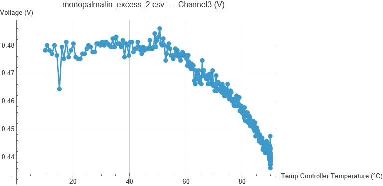

# Harper Lab — Automated Lipid X-Ray/Light-Scattering Platform

## Problem Statement

Lipid characterization by x-ray diffraction or light scattering is precise but slow and
access-limited, since it's largely confined to shared user facilities like the Advanced Photon
Source.

## Vision Statement

Automate and accelerate the light-scattering and electron-density characterization of lipids with
an in-house instrument.

## Solution

Josh 2.0: a servo-driven sample stage that holds up to four samples and runs light-scattering
experiments across a 10-100°C range under automated temperature control.

### Software

- **[v1](v1/)** — legacy command-line control executables (C++).
- **[v2](v2/)** — current system: a Wolfram LibraryLink DLL and paclet giving Mathematica direct
  control over the fluid bath, temperature controller, servo motors, and LabJack ADC. See
  [v2/README.md](v2/README.md) for build and usage instructions.

### Results

Intensity-vs-temperature scans from representative rise runs (full data set in
[v2/data](v2/data), all scans in [v2/graphs/intensity_temp](v2/graphs/intensity_temp)):

[0_intensity_vs_temp_rise_10_to_100.pdf](v2/graphs/intensity_temp/0_intensity_vs_temp_rise_10_to_100.pdf) ·
[80_intensity_vs_temp_rise_10_to_75.pdf](v2/graphs/intensity_temp/80_intensity_vs_temp_rise_10_to_75.pdf) ·
[80_intensity_vs_temp_rise_10_to_85.pdf](v2/graphs/intensity_temp/80_intensity_vs_temp_rise_10_to_85.pdf)

### Future Goals

- 3D-print a new separation pad for the sample holder.
- Source longer screws for connecting the base metal block to the separation pad.
- Add hardware for x-ray density (SAXS/WAXS) experiments.

## Authors

- Josh Darrow
- Samuel Ntadom
